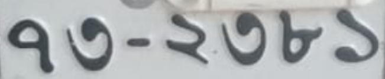
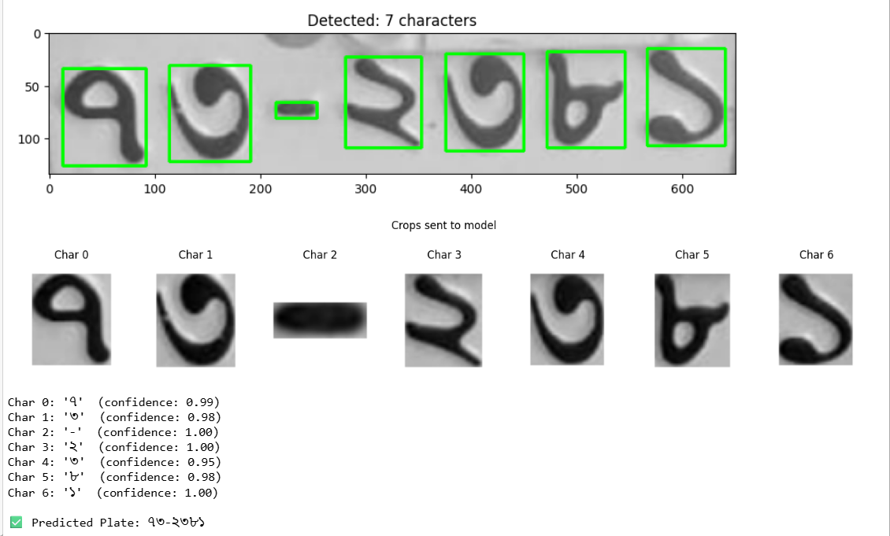

# 🚗 Bangla Car Number Plate Recognition using CNN

> A deep learning system that reads Bangladeshi car number plates  
> and outputs the plate number in **Bangla script** — e.g. `৭৩-২৩৮১` ✅

[](https://python.org)
[](https://tensorflow.org)
[](https://opencv.org)
[](https://jupyter.org)

---

## 📸 What It Does

Takes a cropped image of a Bangladeshi car number plate as input  
and outputs the full plate number in Bangla digits.

**Input:** Cropped plate image  
**Output:** `৭৩-২৩৮১`

---

## 📸 Demo

| Input Plate | Predicted Output |
|:-----------:|:----------------:|
|  |  |


---

## ⚙️ How It Works
Plate Image (grayscale)
↓
Otsu Thresholding  →  finds digit locations
↓
Contour Detection  →  isolates each character
↓
Crop from original image  →  64×64 white canvas
↓
CNN predicts each digit
↓
Final output: ৭৩-২৩৮১

---

## 📁 Dataset

| Property | Value |
|----------|-------|
| Total Classes | 11 (Bangla digits ০–৯ and dash (-)) |
| Images per Class | At least 30 |
| Total Images | Around 330 |
| Image Size | 64 × 64 pixels |
| Color Mode | Grayscale |
| Background | Black digit on white background |
| Source | Cropped from real BD car plates |

> ⚠️ Dataset not included in this repo due to size.  
> See `dataset/README.md` for folder structure details.

---

## 🧠 CNN Architecture

| Layer | Type | Output Shape |
|-------|------|-------------|
| 1 | Conv2D — 32 filters, 3×3, ReLU | 62 × 62 × 32 |
| 2 | MaxPooling2D 2×2 | 31 × 31 × 32 |
| 3 | Conv2D — 64 filters, 3×3, ReLU | 29 × 29 × 64 |
| 4 | MaxPooling2D 2×2 | 14 × 14 × 64 |
| 5 | Flatten | 12,544 |
| 6 | Dense — 64 units, ReLU | 64 |
| 7 | Dense — 11 units, Softmax | 11 |

**Optimizer:** Adam (lr=0.0003)  
**Loss:** Sparse Categorical Crossentropy  
**Epochs:** 25

---

## 📊 Results on Test Plate

Tested on plate `৭৩-২৩৮১`:

| Character | Predicted | Confidence |
|-----------|-----------|------------|
| ৭ | ৭ | 0.99 ✅ |
| ৩ | ৩ | 0.98 ✅ |
| - | - | — ✅ |
| ২ | ২ | 1.00 ✅ |
| ৩ | ৩ | 0.95 ✅ |
| ৮ | ৮ | 0.98 ✅ |
| ১ | ১ | 1.00 ✅ |

**Final predicted plate: `৭৩-২৩৮১` — 100% correct 🎯**

---

## 🔑 Key Lessons from This Project

These are the critical mistakes to avoid when building a similar system:

1. **Never hardcode class names** — always use `train_data.class_names` from the Keras loader
2. **Crop source must match training style** — crop from original grayscale, not from the binary threshold image
3. **Canvas background must match** — white canvas (255) for a model trained on white backgrounds
4. **Dash needs its own contour filter** — its height is only 14% of the plate height and aspect ratio is 2.41, completely different from digits
5. **Preprocessing must be identical** at training time and inference time — this matters more than model complexity

---

## 🚀 How to Run

### 1. Clone the repo
```bash
git clone https://github.com/NusraatMili/Bangla-NumberPlate-CNN
cd Bangla-NumberPlate-CNN
```

### 2. Install dependencies
```bash
pip install tensorflow opencv-python numpy matplotlib jupyter
```

### 3. Prepare your dataset
Create 11 subfolders inside the `dataset/` folder:
dataset/
├── ০/     ← At least 30 images each
├── ১/
├── ২/
├── ৩/
├── ৪/
├── ৫/
├── ৬/
├── ৭/
├── ৮/
├── ৯/
└── dash/

### 4. Open the notebook
```bash
jupyter notebook bangla_plate_cnn.ipynb
```
- Run **1st Part** cells to train the model
- Update `img_path` in **2nd part** to point to your test plate image
- Run **2nd part** cells to predict the full plate number

---

## 📄 Files in This Repo

| File | Description |
|------|-------------|
| `bangla_plate_cnn.ipynb` | Full Jupyter notebook — training and prediction |
| `bangla_plate_cnn_report.docx` | Complete technical report (design, implementation, results) |
| `test/car3.png` | Sample test plate image |
| `dataset/README.md` | Dataset folder structure guide |

---

## 🔮 Future Work

- [ ] Data augmentation to expand beyond 30 images per class
- [ ] YOLO integration to auto-detect and crop plates from full vehicle photos
- [ ] Deploy as a web app using Flask or Streamlit
- [ ] Test on more diverse plate conditions — lighting, angle, damage

---


## 👩‍💻 Author

**Nusrat Mili**

[](https://www.linkedin.com/in/nusrat-mili-3a21a9162/)
[](https://github.com/NusraatMili)
